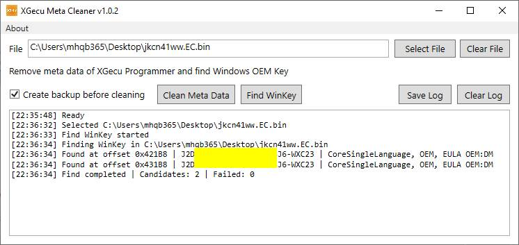
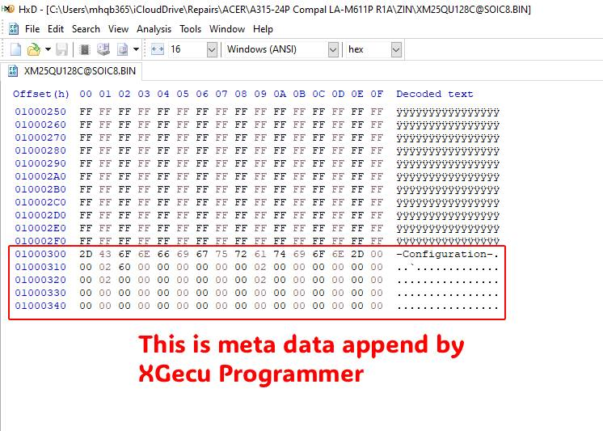
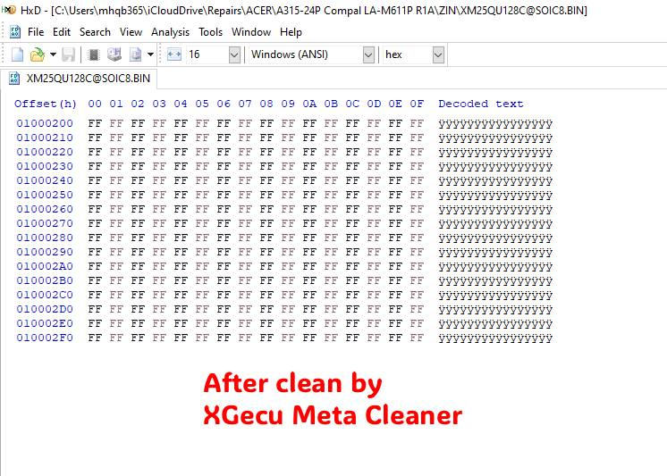

# XGecu Meta Cleaner

When you save a BIOS file by XGecu Programmer, it will be append meta data at the end of the content. This causes errors when importing into another programmer. Therefore, you need to clean the meta data before sending the BIOS file to anyone.

In addition, this tool also helps you find the Windows OEM product key in the BIOS.

Drag and drop the BIOS file (read and saved by XGecu) onto the XGecu Meta Cleaner icon before sending it to anyone.

